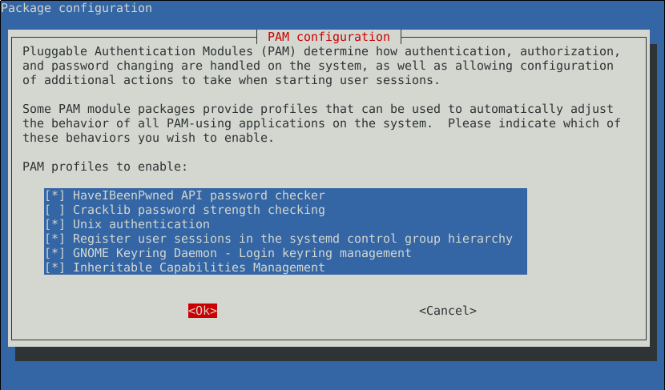
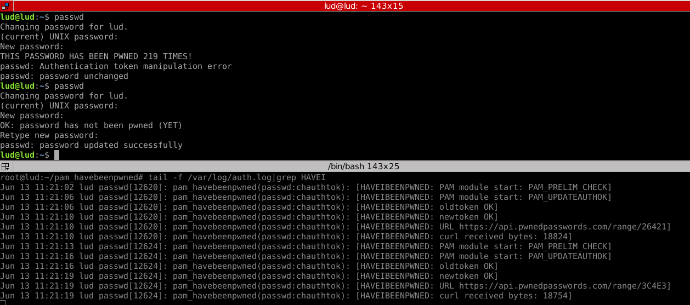

# pam_havebeenpwned

This PAM security module integrates the **IHaveBeenPwned API**
(https://haveibeenpwned.com/)  written by
@Troy Hunt into PAM. Every time a user types a new password, a call to
the API is made. If the password has been pwned, the module
returns **PAM_AUTHOK_ERR** and the password is not changed.

This module leverages their **K-Anonymity password database**
(https://www.troyhunt.com/ive-just-launched-pwned-passwords-version-2/#cloudflareprivacyandkanonymity)

# Build & Install

* Install the **pre-requisites** first:

	apt-get install libssl-dev libcurl4-openssl-dev libpam-dev

* Then, build & install the module:

	git clone https://github.com/nonamed01/pam_havebeenpwned.git  
	cd pam_havebeenpwned  
	make  
	su -c "make install"

* Enable the module automatically by running **pam-auth-update** (see below)
  or, alternatively, you can do it by hand:

* Edit **/etc/pam.d/common-passwd** and add the following line *BEFORE* the
  first pam_unix.so entry:

	password requisite pam_havebeenpwned.so [options]

* Append "try_first_pass" to the first pam_unix.so entry, so that the line
	right beneath the pam_havebeenpwned.so entry looks like this:

	password        [success=1 default=ignore]      pam_unix.so obscure sha512 try_first_pass

# Automatic configuration using pam-auth-update

Run:
	
	pam-auth-update

And enable the module using the ncurses-gui interface as shown here:

The priority for this module is calculated according to https://wiki.ubuntu.com/PAMConfigFrameworkSpec.  
By default, these are the enabled module options (see **Module options**):  

* minlen=8
* seen 
* timeout=20
* enforceonerror

# Updating

cd pam_havebeenpwned  
git pull  
make  
pam-auth-update and disable the module  
su -c "make install"

# Documentation

run:  

man pam_havebeenpwned

# Example of /etc/pam.d/common-password on a Debian system

password 	requisite 	pam_havebeenpwned.so minlen=8  
password	[success=1 default=ignore]	pam_unix.so obscure sha512 try_first_pass  
password	requisite			pam_deny.so  
password	required			pam_permit.so  
password	optional	pam_gnome_keyring.so  

# Module options

	* debug.		If set, you will get debugging messages through /var/log/auth.log

	* minlen.		The minimum password length. By default, 6 characters (hard-coded).

	* seen.			If set, it will print the number of times this password has been seen. 

	* timeout.		The total number of seconds until CURL aborts the request. Default: 10s.

	* enforceonerror.	 If set, whenever an error occurs communicating with the API (Network
						 errors, API errors, and so on) the module returns PAM_AUTHTOK_ERR and exits.

	EXAMPLES:
	
	password requisite pam_havebeenpwned.so minlen=8 debug  
	password requisite pam_havebeenpwned.so minlen=12 seen
	password requisite pam_havebeenpwned.so minlen=12 timeout=20 seen debug enforceonerror

# Screenshot

